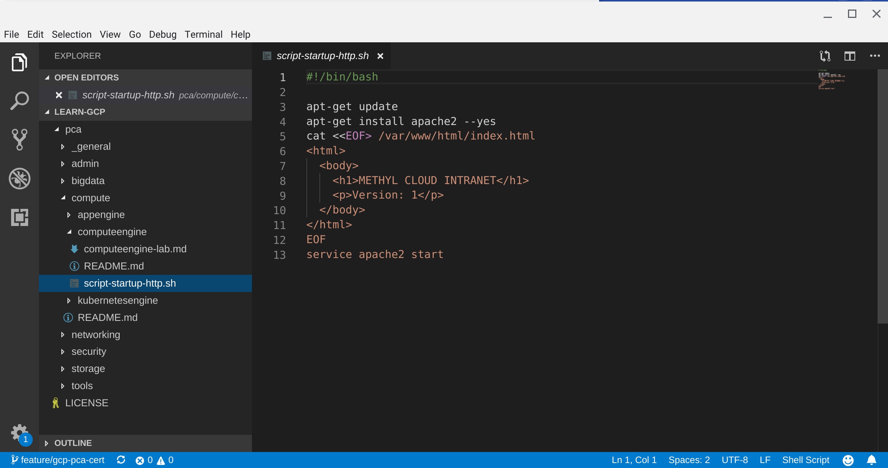

# GCP in a ~~nut~~bash shell

GCP in a bash shell is an educational repository to share study resources to learn [Google Cloud Platform (GCP)][1].

## Goal
It started as a personal project to store notes while preparing the [Professional Cloud Architect][2] certification. I found valuable the ability to revisit previous notes to help understand intricate concepts and have labs artifacts (lab procedures, code samples) handy. I hope this project could help others to study and pass their GCP certification exams.

## Project Status
 - **Professional Cloud Architect (PCA)**
   Unedited notes available in [docs/cert-pca/][3]
 - **Associate Cloud Engineer (ACE)**
   In Progress

## Learning principles
The repository and notes are organized around a set of learning principles.

 - **Provide a good foundation over trying to explain everything**
   The goal of the repository is not to cover every single GCP concept, use case or item tested in the certification. It is to provide an abbreviated set of resources to understand foundational tenets to work with GCP and score well on the exams.
 - **Keep it concise**
   There is a lot of material to study and cover. Notes are taken in a concise format speeding both note taking and review.
 - **Favor substance over form**
   In the interest of brevity, notes are edited and saved in Markdown format to focus on the content over the form.
 - **Allow spaced repetition learning**
   The notes are taken in a way that structure information under a question. This approach enables readers to test themselves and reinforce learning by using the Markdown Code Folding feature in their editor/IDE. This is a crude but functional method to practice [spaced repetition][4], a scientifically proven technique to maximize memory retention over time. A better future approach could rely on using Anki files.
 - **Learning by doing**
   Most resources provide both theoretical and practical notes to get familiar with the technology in labs.

## Assumptions
The notes are created under a few assumptions:

 - Readers are already familiar with basic concepts of computer systems and networks (internet, linux, script languages)
 - Readers have created a sandbox GCP environment

## Folder structure
  - ``common/`` used to store notes for common knowledge shared and tested across certifications
  - ``pca/`` folder to store notes specific about a certification
  - ``pca/compute`` subfolder to categorize GCP services by family
  - ``pca/compute/computeengine`` subfolder to store notes on a GCP service
  - ``pca/.certs/`` subfolder to store notes about certification expectations and non-technical knowledge

## Lab organization
The lab section of the notes were created taking the example of methyl.cloud. A fictional organization name to work with a domain and GCP organization. Readers are advised to create their own organization and substitute "methyl" mention by their own lab environment name.

## What is this project good for?
 - Check if you are familiar with most of the concepts tested by the certification.
 - Help learn and memorize important concepts required by the certifications.
 - Practice labs to get familiar with core GCP services
 - Provide a handy way to review/refresh your knowledge before taking the exam

## What is this project **not** good for?
 - Replace learning from more comprehensive sources (Courses, Official documentation, Qwiklabs)
 - Take the certification exam without studying any other source than this repo.

## Contributing
If you like the project and want to contribute, there are a few ways to get involved:

 - Provide feedback, comments or requests as a Git issue
 - Add or edit content by cloning the repository, creating a feature/x branch and submit a Pull Request.

[//]: # (URLS)
[1]: https://cloud.google.com/
[2]: https://cloud.google.com/certification/cloud-architect
[3]: docs/cert-pca/
[4]: https://en.wikipedia.org/wiki/Spaced_repetition
